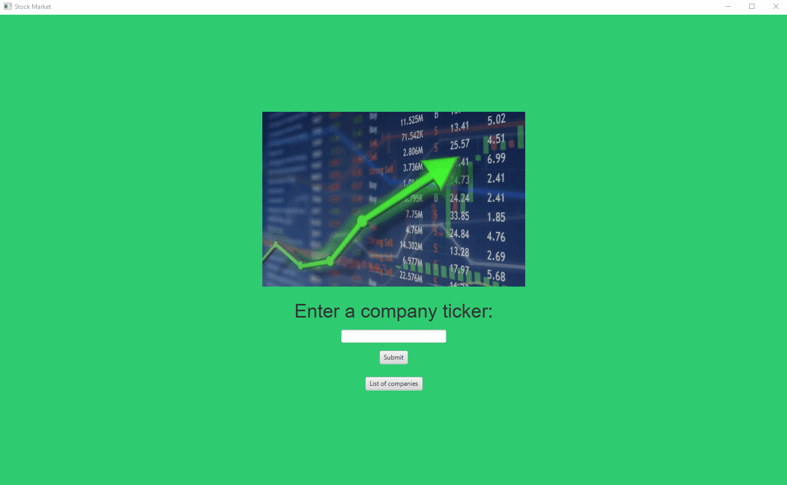

# Stock-Market
My first application using the JavaFX library. It allows the user to search a stock and see its history displayed on a line graph. From there, the user can see various information like closing price, low/high, volume for each individual day. The data is pulled from a CSV file and parsed within the application.

